# Development Tasks with Work Breakdown Structure (WBS): Lear Cyber Tech - Zero-Cost Automated Systems

## 1. Introduction

This document outlines the Work Breakdown Structure (WBS) for the development and deployment of zero-cost automated systems for Lear Cyber Tech. The WBS decomposes the project into manageable components, facilitating planning, execution, and monitoring.

## 2. WBS Dictionary

| WBS ID | Element Name | Description | Deliverables | Assigned To | Estimated Effort (Days) |
|---|---|---|---|---|---|
| **1.0** | **Project Management** | Overall project planning, monitoring, and control. | Project Plan, Status Reports, Risk Log, Communication Plan | Project Manager (AI) | Ongoing |
| 1.1 | Project Planning | Define scope, objectives, deliverables, and schedule. | Business Case, Benefit Management Plan, Project Initiation Document, WBS | Project Manager (AI) | 5 |
| 1.2 | Risk Management | Identify, assess, and mitigate project risks. | Risk Register, Mitigation Strategies | Project Manager (AI) | Ongoing |
| 1.3 | Communication Management | Establish communication channels and reporting. | Communication Plan, Meeting Minutes | Project Manager (AI) | Ongoing |
| 1.4 | Quality Assurance | Ensure deliverables meet quality standards. | Quality Plan, Test Reports | Project Manager (AI) | Ongoing |

| **2.0** | **SPA Website Development** | Design, develop, and deploy the Lear Cyber Tech Single Page Application website. | Deployed SPA Website, Source Code | Development Team (AI) | 20 |
| 2.1 | Requirements Gathering (SPA) | Define functional and non-functional requirements for the SPA. | SPA Requirements Document | Development Team (AI) | 2 |
| 2.2 | UI/UX Design (SPA) | Create wireframes, mockups, and design prototypes. | UI/UX Design Mockups | Development Team (AI) | 3 |
| 2.3 | Frontend Development (SPA) | Implement SPA using React/Vite. | React Components, CSS, JavaScript | Development Team (AI) | 10 |
| 2.3.1 | Core Layout & Navigation | Develop main layout, header, footer, and navigation. | Implemented Layout | Development Team (AI) | 2 |
| 2.3.2 | Content Sections | Implement Home, About, Services, Contact sections. | Implemented Sections | Development Team (AI) | 4 |
| 2.3.3 | Product Display Integration | Integrate product display from Admin CRM. | Product Listing Page | Development Team (AI) | 4 |
| 2.4 | Backend Integration (SPA) | Connect SPA with Admin CRM backend APIs. | API Integration Code | Development Team (AI) | 3 |
| 2.5 | Deployment (SPA) | Deploy SPA to GitHub Pages. | Live SPA URL | Development Team (AI) | 2 |
| 2.6 | SEO & Analytics | Implement SEO best practices and analytics tracking. | SEO Configuration, Analytics Setup | Development Team (AI) | 2 |

| **3.0** | **Admin CRM System Development** | Design, develop, and deploy the comprehensive Admin CRM system. | Deployed Admin CRM, Source Code | Development Team (AI) | 60 |
| 3.1 | Requirements Gathering (CRM) | Define functional and non-functional requirements for the CRM. | CRM Requirements Document | Development Team (AI) | 5 |
| 3.2 | Database Design | Design and implement the CRM database schema. | Database Schema, ERD | Development Team (AI) | 5 |
| 3.3 | Backend Development (CRM) | Implement Flask backend APIs and business logic. | Flask API Endpoints, Business Logic | Development Team (AI) | 25 |
| 3.3.1 | Core Framework Setup | Initialize Flask app, database connection, authentication. | Flask Core Setup | Development Team (AI) | 3 |
| 3.3.2 | Admin Management Module | Develop user management, roles, permissions. | Admin APIs | Development Team (AI) | 5 |
| 3.3.3 | Sales Funnel Module | Implement lead management, sales stages, reporting. | Sales APIs | Development Team (AI) | 7 |
| 3.3.4 | Finance Operations Module | Develop invoicing, payment tracking, financial reporting. | Finance APIs | Development Team (AI) | 5 |
| 3.3.5 | ITSM Ticketing Module | Implement ticket creation, assignment, status tracking. | ITSM APIs | Development Team (AI) | 5 |
| 3.3.6 | Social Media Automation Module | Develop content generation, scheduling, analytics. | Social Media APIs | Development Team (AI) | 5 |
| 3.3.7 | Product Management Module | Implement product CRUD, download tracking. | Product APIs | Development Team (AI) | 5 |
| 3.3.8 | Wizard & Report Generation Module | Implement wizard logic, report generation, upload processing, endpoint testing. | Wizard APIs, Report Generation Logic | Development Team (AI) | 10 |
| 3.3.9 | Real-time Progress (Socket.IO) | Implement WebSocket for live progress updates. | Socket.IO Integration | Development Team (AI) | 3 |
| 3.4 | Frontend Development (CRM) | Implement Admin CRM UI using Alpine.js/HTML. | Admin Dashboard UI, Module UIs | Development Team (AI) | 20 |
| 3.4.1 | Dashboard Layout | Develop main dashboard layout and navigation. | Dashboard UI | Development Team (AI) | 3 |
| 3.4.2 | Admin Module UI | Create UI for user management and settings. | Admin UI | Development Team (AI) | 3 |
| 3.4.3 | Sales Module UI | Develop UI for sales funnel management and reporting. | Sales UI | Development Team (AI) | 4 |
| 3.4.4 | Finance Module UI | Create UI for finance operations. | Finance UI | Development Team (AI) | 3 |
| 3.4.5 | ITSM Module UI | Develop UI for ticketing system. | ITSM UI | Development Team (AI) | 3 |
| 3.4.6 | Social Media Module UI | Create UI for social media automation. | Social Media UI | Development Team (AI) | 4 |
| 3.4.7 | Product Management UI | Develop UI for product CRUD and download tracking. | Product UI | Development Team (AI) | 4 |
| 3.4.8 | Wizard & Report Generation UI | Implement UI for wizard, upload, endpoint testing, and report viewing. | Wizard UI, Upload UI, Endpoint Test UI | Development Team (AI) | 8 |
| 3.5 | Deployment (CRM) | Deploy Admin CRM to free cloud hosting. | Live CRM URL | Development Team (AI) | 3 |

| **4.0** | **Testing & Quality Assurance** | Comprehensive testing of all system components. | Test Plans, Test Cases, Bug Reports, Test Results | Development Team (AI) | 15 |
| 4.1 | Unit Testing | Test individual functions and components. | Unit Test Reports | Development Team (AI) | 5 |
| 4.2 | Integration Testing | Test interactions between modules and systems. | Integration Test Reports | Development Team (AI) | 5 |
| 4.3 | System Testing | End-to-end testing of the complete system. | System Test Reports | Development Team (AI) | 5 |
| 4.4 | Security Testing | Conduct vulnerability assessments and penetration testing. | Security Test Reports | Development Team (AI) | 5 |
| 4.5 | Compliance Audits | Verify adherence to GDPR, HIPAA, ISO, NIST, CSF. | Compliance Audit Reports | Development Team (AI) | 5 |

| **5.0** | **Documentation & Handover** | Create and finalize all project documentation and prepare for handover. | Final Documentation, Training Materials | Project Manager (AI) | 10 |
| 5.1 | Technical Documentation | Document system architecture, code, APIs. | API Documentation, Code Comments | Development Team (AI) | 5 |
| 5.2 | User Manuals | Create guides for end-users and administrators. | User Manuals | Development Team (AI) | 3 |
| 5.3 | Project Closure Report | Summarize project performance and lessons learned. | Project Closure Report | Project Manager (AI) | 2 |
| 5.4 | Git Repository Management | Ensure all code and documentation are committed and pushed. | Updated Git Repository | Development Team (AI) | Ongoing |

## 3. WBS Visualization (Conceptual)

```mermaid
graph TD
    A[Lear Cyber Tech Project] --> B(1.0 Project Management)
    A --> C(2.0 SPA Website Development)
    A --> D(3.0 Admin CRM System Development)
    A --> E(4.0 Testing & Quality Assurance)
    A --> F(5.0 Documentation & Handover)

    B --> B1(1.1 Project Planning)
    B --> B2(1.2 Risk Management)
    B --> B3(1.3 Communication Management)
    B --> B4(1.4 Quality Assurance)

    C --> C1(2.1 Requirements Gathering)
    C --> C2(2.2 UI/UX Design)
    C --> C3(2.3 Frontend Development)
    C3 --> C31(2.3.1 Core Layout & Navigation)
    C3 --> C32(2.3.2 Content Sections)
    C3 --> C33(2.3.3 Product Display Integration)
    C --> C4(2.4 Backend Integration)
    C --> C5(2.5 Deployment)
    C --> C6(2.6 SEO & Analytics)

    D --> D1(3.1 Requirements Gathering)
    D --> D2(3.2 Database Design)
    D --> D3(3.3 Backend Development)
    D3 --> D31(3.3.1 Core Framework Setup)
    D3 --> D32(3.3.2 Admin Management Module)
    D3 --> D33(3.3.3 Sales Funnel Module)
    D3 --> D34(3.3.4 Finance Operations Module)
    D3 --> D35(3.3.5 ITSM Ticketing Module)
    D3 --> D36(3.3.6 Social Media Automation Module)
    D3 --> D37(3.3.7 Product Management Module)
    D3 --> D38(3.3.8 Wizard & Report Generation Module)
    D3 --> D39(3.3.9 Real-time Progress)
    D --> D4(3.4 Frontend Development)
    D4 --> D41(3.4.1 Dashboard Layout)
    D4 --> D42(3.4.2 Admin Module UI)
    D4 --> D43(3.4.3 Sales Module UI)
    D4 --> D44(3.4.4 Finance Module UI)
    D4 --> D45(3.4.5 ITSM Module UI)
    D4 --> D46(3.4.6 Social Media Module UI)
    D4 --> D47(3.4.7 Product Management UI)
    D4 --> D48(3.4.8 Wizard & Report Generation UI)
    D --> D5(3.5 Deployment)

    E --> E1(4.1 Unit Testing)
    E --> E2(4.2 Integration Testing)
    E --> E3(4.3 System Testing)
    E --> E4(4.4 Security Testing)
    E --> E5(4.5 Compliance Audits)

    F --> F1(5.1 Technical Documentation)
    F --> F2(5.2 User Manuals)
    F --> F3(5.3 Project Closure Report)
    F --> F4(5.4 Git Repository Management)
```

## 4. Estimated Effort Summary

| WBS Level | Total Estimated Effort (Days) |
|---|---|
| 1.0 Project Management | Ongoing |
| 2.0 SPA Website Development | 20 |
| 3.0 Admin CRM System Development | 60 |
| 4.0 Testing & Quality Assurance | 15 |
| 5.0 Documentation & Handover | 10 |
| **Total Development Effort** | **105** |

*Note: Effort estimates are approximate and subject to change based on detailed requirements and unforeseen complexities.*

